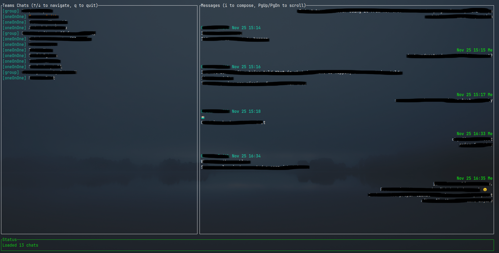

# TeamsTUI

A Rust-based Terminal User Interface (TUI) for Microsoft Teams, built around keyboard-driven navigation.  
Use arrow keys (or h/j) to switch chats, press *i* to enter message-input mode, and enjoy a fast, distraction-free Teams experience inside the terminal.



## Features

- 🔐 Secure OAuth2 authentication (Device Code Flow)
- 💬 View your Teams chats
- ⌨️ Keyboard navigation (Vim-style or arrow keys)
- 🎨 Modern, colorful terminal UI
- 💾 Token persistence (no need to re-authenticate)
- 🖼️ Image attachment indicators (with graphics protocol support)

## Quick Start

**Important:** You need to register your own Azure AD application first!  
(or if you already have one, you can skip to step 2)

### 1. Register Azure AD App

Follow the detailed guide in [AZURE_SETUP.md](AZURE_SETUP.md) to:
- Register an app in Azure Portal
- Get your Client ID
- Configure permissions

### 2. Configure the App

#### 2.1. Using `config.json`
Create a `config.json` file in `~/.config/teams-tui/` directory:
```json
{
  "client_id": "your-client-id-here"
}
```
Replace `your-client-id-here` with your actual Client ID from Azure.

#### 2.2. Using `.env` file
Alternatively, you can use a `.env` file.

Create a `.env` file in this directory:
```bash
cp .env.example .env
```

Replace `your-client-id-here` with your actual Client ID from Azure.

### 3. Run the Application

```bash
# Run the application
cargo run

# Or build and run the binary
cargo build --release
./target/release/teams-tui

# you can also copy binary wherever you want, eg
cp ./target/release/teams-tui /usr/local/bin/teams-tui
# and run from anywhere
teams-tui
```
**Imoportant:** If you use `.env` file, make sure to run the app from the same directory where `.env` is located (still preferred way is to use `config.json` for settings).

## First Time Setup

1. Run the app
2. Open the displayed URL in your browser
3. Enter the code shown in the terminal
4. Sign in with your Microsoft account
5. Grant permissions

## Keyboard Controls

- `↑` / `k` - Move up
- `↓` / `j` - Move down  
- `PgUp` / `PgDn` - Scroll chat
- `i` - Compose message
- `q` - Quit

## Requirements

- Rust 1.70+ (2021 edition)
- Microsoft account with Teams access

## How It Works

This app uses:
- **Microsoft Graph API** to fetch Teams data
- **Ratatui** for the terminal UI
- **OAuth2 Device Code Flow** for authentication
- **ratatui-image** for image rendering (Kitty, Sixel, iTerm2, halfblocks)

Tokens are saved to `~/.config/teams-tui/token.json` and automatically refreshed.

Your profile is saved to `~/.config/teams-tui/profile.json` (limits API calls).

If at some point you want/need to re-authenticate, just delete the `token.json` file (and eventually `profile.json`).

## TODO

- [ ] Set messages as `read` when viewed
- [ ] Send multi line messages
- [x] Adding info when attachment/image was added to a message (currently it strips attachments)
- [x] Showing images (using Kitty graphics protocol with Sixel/iTerm2/halfblock fallbacks)
- [ ] Yanking urls (eventually adding some kind of vim mode to select/yank any text)
- [ ] Notification when new message will arrive (bell in terminal? system notification? maybe notification mode so user can switch between different modes? 0 - none, 1 - terminal bell, 2 - system notification)

## Image Display

TeamsTUI supports displaying images using the [ratatui-image](https://github.com/benjajaja/ratatui-image) crate, which provides multiple graphics protocol backends:

- **Kitty** - The Kitty terminal graphics protocol (best quality)
- **Sixel** - Works with xterm, foot, mlterm, and other terminals
- **iTerm2** - For iTerm2 on macOS, WezTerm, and Rio
- **Halfblocks** - Unicode fallback for terminals without graphics support

The terminal protocol is automatically detected at startup. Image attachments in messages are currently displayed with indicators (📷 [Image: filename]), with the infrastructure in place for full inline image rendering.

## License

TeamsTUI is licensed under the MIT License. See [LICENSE](LICENSE) for details.

## Thanks For Visiting
Hope you liked it. Wanna **[buy Me a coffee](https://www.buymeacoffee.com/nospor)**?
